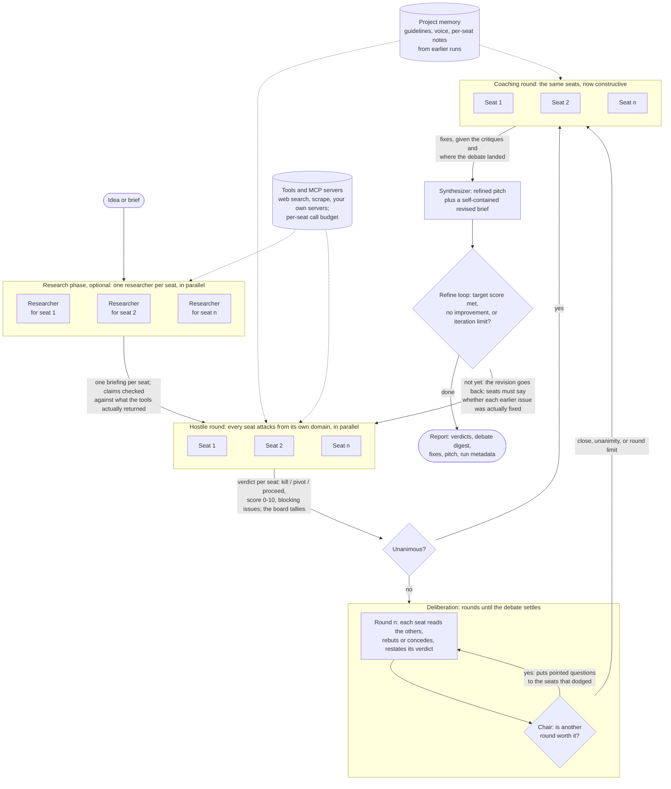

# Idea Refiner: an agentic AI boardroom

Stress-test an idea in front of a board of AI experts, then let the same experts coach you, then get a
refined pitch. Boards are declared in YAML, so the same engine runs a startup board, an architecture
review board, or anything you define. Works with cloud LLMs (OpenAI, Anthropic, Mistral, Gemini, Groq,
OpenRouter) and fully locally (Ollama, LM Studio, any OpenAI-compatible server).

Born from a Colab notebook ("AI Investor Board", CrewAI + Mistral). Now a CLI, a REST API and a web UI
sharing one engine.

> Don't ask AI to build your product. Ask AI to kill your idea, so only the strongest survive.

## How it works

Every board runs up to four phases (plus an optional research phase first, see [Agent tools](#agent-tools)):



What makes this agentic rather than a prompt chain: each seat is its own agent with a role, a failure
mode it hunts for, optional tools with a hard call budget, and memory of what it said last time; and the
control flow is decided at run time, not in advance. The chair decides how many deliberation rounds
happen and whom to press, the tally decides whether there is anything to debate at all, and the refine
loop decides whether the board sits again. Two runs of the same board on the same idea can take
different paths, and the report records which path was taken.

1. **Hostile**: each agent tears the idea apart from its own domain and ends with a verdict.
2. **Deliberation**: the critics read each other and rebut or concede, round after round. After each
   round a **chair** agent decides whether another round is worth it and puts pointed questions to the
   members who dodged a point. The debate ends when the board is unanimous, the chair closes it, or the
   round limit is hit, so how long it runs depends on how the debate goes.
3. **Coaching**: the same agents, now constructive, get the idea, the critiques and where the debate
   landed, and propose fixes.
4. **Synthesis**: one agent distils everything into a refined pitch.

In the hostile round each critic ends with a structured verdict (`kill | pivot | proceed`, a 0-10 score,
up to three blocking issues). The board tallies them: majority, mean score, who dissents. Parsing is
lenient so small local models work too; a seat that returns no valid verdict is listed as missing
rather than failing the run. Set `verdicts: false` on a board to turn this off. If the opening round is already unanimous there is
nothing to debate and deliberation is skipped.

**Refine loop** (`--iterate N`, or `refine:` on a board or in the API body): the synthesizer also writes a
self-contained revised brief, and that brief goes back in front of the board as the next revision. The
critics see what they said about the previous version and must say whether each issue was actually fixed.
The loop stops when a revision clears the target (mean score >= `target_score`, at most `max_kills` kill
votes), when a revision fails to improve on the previous score, or at the iteration limit. A revision the
loop stops on is judged but not re-synthesized, so the pitch you get is the one the board last scored.

```bash
refiner run -f idea.md --iterate 3 --target 7
```

```yaml
refine: { max_iterations: 3, target_score: 7, max_kills: 0 }   # board default; 1 = single pass
```

Agents within a round run in parallel: 4 at a time for cloud providers, 1 for local servers (one model in
RAM). Override with `REFINER_CONCURRENCY`.

The built-in `startup` board is the original one: Hardened VC, Scaling CTO, Product Manager, General
Counsel, CISO / Grey-Hat Hacker, and a Founder who synthesises. The `architecture` board reviews a
technical design (SRE, AppSec, Data, FinOps, Platform, Lead Architect).

## Install

Python 3.11+.

```bash
git clone <this repo> && cd agentic-idea-refiner
python -m venv .venv && . .venv/bin/activate        # Windows: .venv\Scripts\activate
pip install -e ".[dev]"
```

Faster alternative with [uv](https://docs.astral.sh/uv/) (same `pyproject.toml`, resolves CrewAI's
dependency tree in seconds):

```bash
pip install uv && uv pip install -e ".[dev]"
```

## Configure an LLM

Copy `.env.example` to `.env` and set what you use. Vendor keys keep their standard names.

| Provider            | Key env              | Default model              | Notes                                   |
|---------------------|----------------------|----------------------------|-----------------------------------------|
| `openai`            | `OPENAI_API_KEY`     | `gpt-4o`                   |                                         |
| `anthropic`         | `ANTHROPIC_API_KEY`  | `claude-sonnet-5`          |                                         |
| `mistral`           | `MISTRAL_API_KEY`    | `mistral-large-latest`     | what the notebook used                  |
| `gemini`            | `GEMINI_API_KEY`     | `gemini-2.5-pro`           |                                         |
| `groq`              | `GROQ_API_KEY`       | `llama-3.3-70b-versatile`  |                                         |
| `openrouter`        | `OPENROUTER_API_KEY` | `openai/gpt-4o`            |                                         |
| `ollama`            | none                 | `llama3.1`                 | `http://localhost:11434`, local         |
| `lmstudio`          | none                 | `local-model`              | `http://localhost:1234/v1`, local       |
| `openai-compatible` | optional             | required                   | vLLM, llama.cpp, LiteLLM proxy; needs `--base-url` |

The provider is auto-detected from the keys present, falling back to a local Ollama. Force it with
`REFINER_PROVIDER` / `REFINER_MODEL` in `.env`, or per run with `--provider` / `--model` / `--base-url`.

Local models: Ollama 0.3 or newer is needed for Llama 3.2 class models, and a 3B model wants roughly 4 GB
of free RAM. `refiner check` tells you quickly whether the endpoint can actually serve the model.

```bash
refiner providers                       # what is configured
refiner check                           # one tiny call to confirm key + endpoint work
refiner check -p ollama -m qwen2.5:14b
```

## CLI

```bash
refiner run "A two-pass legal document comparison system that runs locally with Qdrant and FastAPI."
refiner run -f idea.md -b architecture -p anthropic
cat idea.md | refiner run - --phase hostile          # only the brutal round
refiner run -f idea.md --server http://localhost:8000  # run on a remote API instead of in-process
refiner run -f idea.md --json > result.json
```

Each run is saved under `runs/<id>/` as `result.json` and `report.md`.

```bash
refiner runs list
refiner runs show <id>
refiner runs pdf <id>          # needs: pip install "idea-refiner[pdf]"
```

## Boards in YAML

```bash
refiner boards list
refiner boards show startup
refiner boards init my-board    # writes ./boards/my-board.yaml, picked up automatically
refiner boards validate ./boards/my-board.yaml
refiner run -b my-board "..."
refiner run -b ./somewhere/else.yaml "..."
```

Boards are searched in this order, later wins on the same name: built-in, `~/.idea-refiner/boards`,
`./boards`, `REFINER_BOARDS_DIR`. Dropping a `startup.yaml` in `./boards` overrides the built-in one.

Minimal board:

```yaml
name: legal-review
description: Contract review from three angles.

agents:
  - id: litigator
    role: Litigation Partner
    focus: clauses that lost in court
    coach: { role: Litigation Partner (Coach), focus: drafting clauses that hold }
  - id: privacy
    role: Data Protection Officer
    focus: GDPR findings nobody saw coming
    llm: ollama/llama3.1            # per-agent model override, optional

synthesizer:
  role: General Counsel
  goal: Rewrite the contract summary so it survives review
  backstory: You have negotiated hundreds of these.

deliberation:                             # optional; this is the default
  rounds: 2                               # upper bound, 1-6
  stop_on_consensus: true
  chair: { role: Board Chair }            # `chair: null` = no chair, stop when nobody changes verdict

phases: [hostile, deliberation, coaching, synthesis]   # drop any you do not want
```

An agent needs only `id`, `role` and `focus` (what this expert has watched projects die from). Everything
else is generated from templates. Overrides available per agent: `hostile: {role, focus, goal,
backstory}`, `coach: {...}`, `llm`, `max_iter`. A board-wide `llm:` applies to all agents.

Prompt templates live under `prompts:` and can be overridden per board (`goal`, `backstory`,
`hostile_task`, `deliberation_task`, `chair_task`, `coaching_task`, `synthesis_task`, `expected_output`,
`synthesis_expected`, `hostile_tone`, `coaching_tone`, `sentences`, `synthesis_sentences`, `verdict_format`,
`chair_format`). Placeholders: `{role}`, `{focus}`, `{tone}`, `{idea}`, `{feedback}`, `{hostile_feedback}`,
`{deliberation}`, `{verdict}`, `{coaching_advice}`, `{sentences}`; deliberation adds `{round}`, `{own}`,
`{others}`, `{standing}`, `{question}`; the chair gets `{round}`, `{rounds}`, `{positions}`, `{standing}`,
`{movement}`, `{ids}`. See
`src/idea_refiner/boards/architecture.yaml` for an example.

LLM resolution order, most specific wins: agent `llm` > request (`--provider`/`--model`, or the API
body) > board `llm` > environment.

## Agent tools

Seats can use tools to check facts instead of guessing. Tools are referenced by name only, so a board
cannot make the server run arbitrary code:

| tool         | what it does                                  | needs            |
|--------------|-----------------------------------------------|------------------|
| `web_search` | Google results (title, link, snippet)         | `SERPER_API_KEY` (serper.dev) |
| `scrape`     | text of a public web page, capped at 6000 chars | nothing        |

```bash
pip install "idea-refiner[tools]"
refiner tools                 # what is available and ready here
```

```yaml
agents:
  - id: vc
    role: Hardened Venture Capitalist
    focus: lack of defensibility and market fit
    tools: [web_search, scrape]
tool_phases: [hostile]        # phases where seats may use tools (default); keeps cost bounded
```

A seat with tools gets up to 8 reasoning steps instead of 3 and a hard budget of 4 tool calls
(`tool_budget`); a tool that fails twice is switched off for the rest of that task. Seats are asked to cite
URLs and told to treat web content as untrusted data. `scrape` refuses private, loopback and link-local addresses, so a URL
planted in an idea or a web page cannot reach internal services. Missing keys fail the run before the
first LLM call. Every tool call is recorded on the agent's output, streamed as a `tool` event and listed
in the report.

### Research phase

`refiner run --research` (or the research checkbox, `"research": true` in the API, or `research` in a
board's `phases`) adds a phase before the hostile round: one researcher per seat, in parallel, looks for
evidence on that seat's concern (the VC's researcher on defensibility and market fit, the counsel's on
regulation...). Each critic then gets its own briefing and is asked to cite it or dispute it. Research runs
once per run, not per refine revision.

Briefings are checked against what the tools actually returned. If no tool call returned anything, the
draft is discarded and the critics are told research was unavailable: models readily invent
sourced-looking facts when every search failed. Citations no tool returned are listed as unverified.

```yaml
research:                        # optional; these are the defaults
  role: Research Analyst
  tools: [web_search, scrape]
  tool_budget: 6
  # llm: openai/gpt-4o           # research can use its own model
```

### MCP servers

Give seats (and researchers) the tools of any MCP server: an internal knowledge base, a CRM, a docs
search. Declare servers once per board or project, then reference them per seat, optionally limited to
specific tools:

```yaml
mcp_servers:
  kb:                                   # a local server the refiner starts
    command: npx
    args: ["-y", "@acme/kb-mcp"]
    env: { KB_TOKEN: "${KB_TOKEN}" }    # ${VAR} comes from the environment / .env, never from YAML
  crm:                                  # a remote server
    url: https://crm.internal.example/mcp
    headers: { Authorization: "Bearer ${CRM_TOKEN}" }
    # transport: sse                    # default is streamable HTTP

agents:
  - id: vc
    role: Hardened Venture Capitalist
    focus: lack of defensibility and market fit
    mcp: [{ server: crm, allow: [search_accounts] }]   # only this tool
research:
  mcp: [kb]                             # researchers can use it too
```

```bash
refiner mcp my-board                    # connect and list each server's tools, and which seats use them
refiner mcp -P my-project
```

MCP tools go through the same wrapper as the built-in tools: they count against the seat's tool budget,
are switched off after two failures, have their output capped, and every call is logged. The model sees
them as `<server>_<tool>` (e.g. `crm_search_accounts`). A server that cannot be reached costs that seat
the tool (reported as a failed `tool` event), not the run. Missing commands and unset `${VAR}`s fail
the run before the first LLM call.

**Security.** A server with `command` starts a local process with the server's privileges. Such servers
are accepted only from boards and projects read from disk (your files). A board that arrives as inline
YAML, e.g. through a future API board editor, may only use `url` servers, unless you set
`REFINER_ALLOW_MCP_COMMANDS=true`. Keep that off whenever the API is reachable by anyone but you.

## Projects: refine one idea over many sessions

A project is a directory holding one idea and everything the board should know about it:

```
projects/<name>/
  project.yaml       board, llm, refine defaults, which seats sit on the board
  idea.md            the current statement of the idea
  guidelines.md      injected into every agent's prompt (audience, constraints, non-negotiables)
  voice.md           ditto (how outputs should sound)
  style.md           ditto (format, length, terminology)
  agents/*.yaml      custom agents, one AgentSpec per file, added to the board
  memory/<seat>.md   each seat's notes from earlier runs: its verdict, issues and advice
  memory/board.md    the board's outcomes, read by the chair and the synthesizer
  runs/<id>/         result.json, report.md, board.json (the exact board that ran)
  history/           earlier versions of idea.md
```

```bash
refiner projects init flags -f idea.md -b startup
$EDITOR projects/flags/guidelines.md
refiner run -P flags --iterate 3        # idea, board, guidelines and memory come from the project
refiner projects show flags --memory
refiner projects adopt flags            # the latest refined idea becomes idea.md; the old one goes to history/
refiner run -P flags                    # the board remembers what it said last time
```

Mix built-in and custom seats in `project.yaml`: a string keeps that seat from the board, a mapping adds
a custom agent (or replaces the seat with the same id), and files in `agents/` are always added:

```yaml
board: startup
agents:
  - vc
  - ciso
  - {id: devrel, role: Developer Relations Lead, focus: developer tools nobody adopted}
refine: {max_iterations: 3, target_score: 7}
memory: true          # false = no notes written or read
mcp_servers: {}       # added to the board's servers (same format as in boards)
```

Memory is plain Markdown written after each run from the verdicts and advice, with no extra LLM call.
The most recent 4 entries per seat go into its prompts; the files keep everything, and you can edit
or delete them. Guidelines are per project, never global.

## REST API

```bash
refiner serve                 # http://127.0.0.1:8000
refiner serve --dev           # auto-reload
refiner serve --workers 4     # Linux/macOS; Windows always runs single-process
```

| Method | Path                         | Purpose                                              |
|--------|------------------------------|------------------------------------------------------|
| GET    | `/api/health`                | version, resolved provider                           |
| GET    | `/api/providers`             | provider catalogue, whether each key is present      |
| GET    | `/api/tools`                 | agent tools and what each still needs                |
| GET    | `/api/boards`                | all boards                                           |
| GET    | `/api/boards/{name}`         | one board                                            |
| POST   | `/api/boards/validate`       | `{yaml}` -> parsed board or 422 with the error       |
| POST   | `/api/runs`                  | `{idea, board?, project?, llm?, phases?, title?, refine?, research?}` -> 202 `{id}` |
| GET    | `/api/runs`                  | run summaries, newest first                          |
| GET    | `/api/runs/{id}`             | status plus full result when done                    |
| GET    | `/api/runs/{id}/events`      | Server-Sent Events: replays history, then streams    |
| GET    | `/api/runs/{id}/report.md`   | Markdown report                                      |
| DELETE | `/api/runs/{id}`             |                                                      |
| GET    | `/api/projects`              | project summaries                                    |
| POST   | `/api/projects`              | `{name, idea, board?, description?}` -> 201          |
| GET    | `/api/projects/{name}`       | spec, docs, resolved board, memory, run ids          |
| PUT    | `/api/projects/{name}/docs/{doc}` | `{text}` for `idea`, `guidelines`, `voice`, `style` |
| POST   | `/api/projects/{name}/adopt` | `{run_id?}`: refined idea becomes `idea.md`           |

Event types: `run_start`, `phase_start`, `agent_start`, `agent_done`, `phase_done`, `decision`, `tool`,
`run_done`, `error`. Events carry `round` for deliberation and a `data` payload: the verdict on `agent_done`, the tally on
`phase_done`, `{action, by}` on `decision` (closing, continuing or skipping a debate; `iterate` or `stop` for
the refine loop, with no `phase`). Every event carries `iteration`. The chair shows up as `agent_id: chair`.

```bash
curl -s localhost:8000/api/runs -H 'content-type: application/json' \
  -d '{"idea":"...","board":"startup","llm":{"provider":"ollama","model":"llama3.1"}}'
curl -N localhost:8000/api/runs/<id>/events
```

## Docker

```bash
docker compose up --build                    # API on :8000, runs persisted in a volume
docker compose --profile local up --build    # also starts Ollama
docker compose exec ollama ollama pull llama3.1
```

Set `REFINER_PROVIDER=ollama` and `REFINER_BASE_URL=http://ollama:11434` in `.env` for the local
profile. Cloud keys in `.env` are passed through. Board YAMLs in `./boards` are mounted read-only.

## Web UI

Svelte 5 app in `web/`: pick a board, provider and model, paste the idea, and watch each agent's card
fill in live over SSE. Past runs are listed in the sidebar; reports download as Markdown.

```bash
cd web && npm install && npm run build   # produces web/dist, which `refiner serve` picks up at /
npm run dev                              # dev server on :5173 proxying /api to :8000
```

## Development

```bash
pytest -q            # no network: the engine takes an injectable executor
ruff check . && ruff format .
```

Layout:

```
src/idea_refiner/
  config.py     settings + provider catalogue
  llm.py        LlmSpec layering -> crewai.LLM
  models.py     BoardSpec / AgentSpec / Prompts (YAML schema), RunResult, Event
  boards.py     YAML discovery and validation
  engine.py     hostile -> coaching -> synthesis on CrewAI, parallel jobs, emits events
  verdicts.py   parse agent verdicts, tally the board
  projects.py   project directories, board mixing, context and memory
  tools.py      agent tool registry, URL guard, tool-call routing
  report.py     markdown / json / pdf
  cli.py        typer CLI
  api/          Sanic app, run store, httpx client
  boards/       built-in boards
```

Design notes:

- The notebook's `crew.kickoff()` returns only the last task's output in sequential mode, so its
  "hostile feedback" was really just the CISO's critique. The engine collects every agent's output.
- CrewAI stays as the orchestration layer so agent tools, delegation and memory can be added later.
- CrewAI telemetry is disabled by default (`CREWAI_TELEMETRY_OPT_OUT`).

## Roadmap

Direction, set on 1 October 2026: from a board that critiques ideas toward a board that can be
**grounded, honest about its uncertainty, and calibrated** for one recurring decision (an architecture
review, a project intake, a pre-mortem), so that the same engine serves as an open demo and as the
core of a tailored deployment. Boards and seats stay YAML in git; the engine stays MIT.

Next, in this order:

1. **Evaluation.** The board against a single well-prompted frontier model on 20 ideas, blind-judged.
   The table goes in this README whatever it says. This decides whether the board pattern earns its cost.
2. **Grounding, two kinds, both optional.** A `grounding:` list per seat naming the sources it may cite.
   *Canon*: a curated local library (books, papers, industry reports) indexed on your machine; the
   indexer and the reading list ship, the texts never do. *Company*: ADRs, standards, past decisions,
   when they exist and are allowed. Both are MCP knowledge servers behind the same field. Canon gives a
   seat authority; company gives it relevance; without either it is still a strong outside reviewer.
3. **Uncertainty policy, instead of silence.** Every claim is labelled *grounded* (with citation),
   *inferred* (with the reasoning) or *speculative*. Doubts become caveats on the verdict; missing
   information becomes questions for the next round, which the refine loop carries forward. A seat only
   declines when the brief gives it nothing to work with, and then it says what it needs.
4. **Research providers.** Perplexity as an optional provider for the research seat (open-web questions,
   slower and paid); the canon is consulted first, the web second.
5. **Store.** SQLite for runs, events, citations, cost per run, calibration sets and scorecards, inside
   the existing Docker image with zero operations; PostgreSQL later through the same layer. YAML remains
   the source of truth for boards and seats.
6. **Calibration.** A `calibration/` set per project: past decisions with their outcomes, blind runs of
   the board, and a scorecard per seat (agreement with what was decided, false alarms, misses, and who
   turned out right where they disagreed). The first set: anonymised past architecture decisions.
7. **Seat library.** Templates with a specific failure mode, grounding slots and the uncertainty
   policy already written: Integration-risk Architect, Run-cost Owner (FinOps), Regulatory Reviewer
   (AI Act, NIS2), Change-fatigue Operations Lead, People Impact, Investor Relations, and more. A board
   seats five to seven of them, composed per decision type; the templates are tailored and calibrated
   per deployment.
8. **Tracing and cost.** OpenTelemetry spans per seat and tool call; tokens and cost per run in the
   report and the UI; a budget cap per run.
9. **Guardrails.** Prompt-injection tests on the idea text and on tool output; schema validation of
   every structured output.

Later, unchanged from before:

- **Web UI**: board YAML editor and validator, run comparison.
- **Support agents**: a scribe (minutes and notes), a cross-checker (contradictions and unsupported
  claims across agents) and configurable synthesizers, supporting the main board members.
- **Structured output**: upload a JSON template and get schema-validated agent output.
- **Report templates**: render the report into a user-supplied `.docx` (corporate template).
- **Tool scripts**: opt-in user Python tools loaded from a local plugin directory, disabled by default and
  never via upload without explicit configuration.
- **Voice input**: record in the browser, transcribe, send to the board.
- **Persona history**: version-controlled changes to roles, backstories and goals per project (each run
  already snapshots its exact board in `board.json`).
- **Scribe memory**: an optional LLM scribe that condenses each seat's notes, instead of the verbatim ones.

## License

MIT
